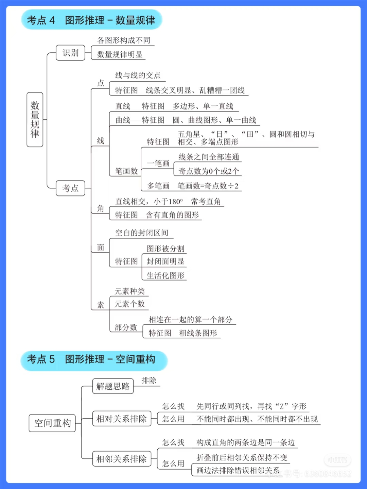
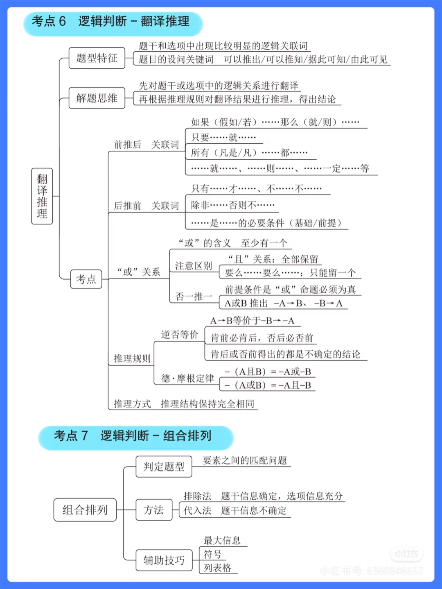

# 📚 图形推理部分

## 🧠 今日学习内容

## 📝 知识点总结

### 1. 图形推理



- 一笔画的技巧
- 立方体（在默认直角边为同一边的基础上，延申）
- 面数的进一步考察（多个面中某个面数量变化：6个面中的三角形从0至三）
- 黑白不考加减法、位移，考对称、数量
- 数量进一步：外框边数、内部交点数

- 立体拼合题（直接）

**常见激活函数**：
- Sigmoid: 输出在 (0,1)
- ReLU: `f(x) = max(0, x)`
- Tanh: 输出在 (-1,1)

---

### 2. Python 实现简单神经元

```python
import numpy as np

def relu(x):
    return np.maximum(0, x)

input = np.array([1, 2, 3])
weight = np.array([0.5, -0.6, 0.1])
output = relu(np.dot(input, weight))
print(output)

